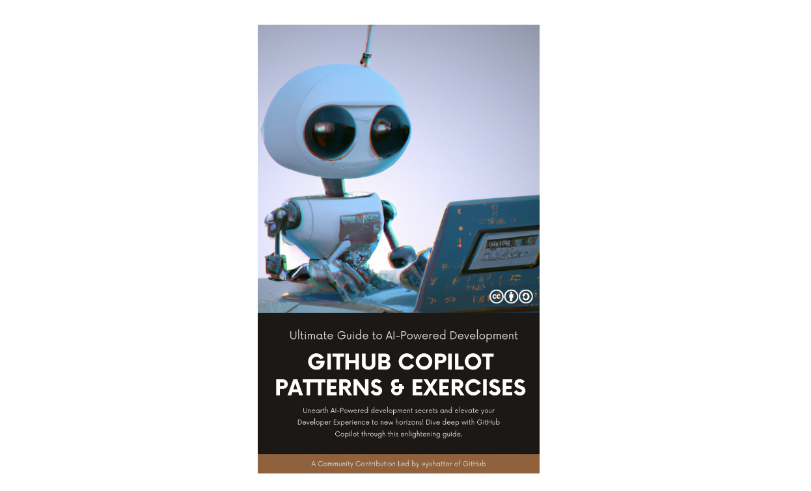
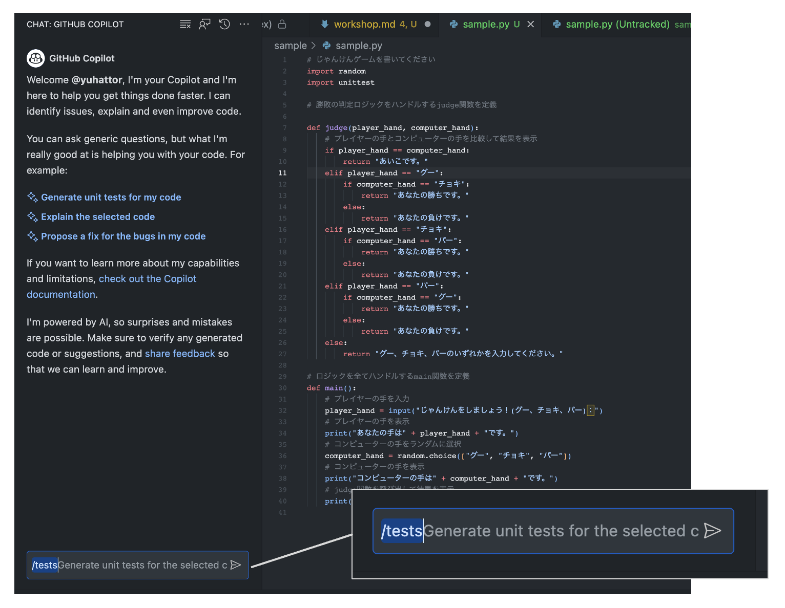

Author: Yuki Hattori
Summary: GitHub Copilot
Id: docs
Environments: Web
Status: Published
Feedback Link: <https://github.com/yuhattor/copilot-handson-jp>

# GitHub Copilot ワークショップ

## ワークショップについて

Duration: 00:02:00

ワークショップは [GitHub Copilot Patterns & Exercises](https://patterns.hattori.dev/ja/) の内容を一部参照しています。

時間の関係上、このワークショップでカバーしきれないパートがありますので、ご興味のある方は、ぜひ [GitHub Copilot Patterns & Exercises](https://patterns.hattori.dev/ja/) もご参照ください。

[](https://patterns.hattori.dev/ja/)


ワークショップの解説に使ったスライドは[こちら](https://speakerdeck.com/yuhattor/github-copilot-workshop)に格納してございます。

[](https://speakerdeck.com/yuhattor/github-copilot-workshop)

## Copilot の感覚を掴む

Duration: 00:05:00

じゃんけんゲームのロジックを書いてみます。お好きな言語を選択して実施してください。 (ハンズオンでは Python を例示します)

コメント部分を 1行1行書いて/コピーペーストをして実施してみてください。

```py
# じゃんけんゲームを書いてください
import random

# ロジックを全てハンドルするmain関数を定義

def main():
    # プレイヤーの手を入力
    player_hand = input("じゃんけんをしましょう！(グー、チョキ、パー)：")
    # プレイヤーの手を表示
    print("あなたの手は" + player_hand + "です。")
    # コンピューターの手をランダムに選択
    computer_hand = random.choice(["グー", "チョキ", "パー"])
    # コンピューターの手を表示
    print("コンピューターの手は" + computer_hand + "です。")
    # プレイヤーの手とコンピューターの手を比較して結果を表示
    if player_hand == computer_hand:
        print("あいこです。")
    elif player_hand == "グー":
        if computer_hand == "チョキ":
            print("あなたの勝ちです。")
        else:
            print("あなたの負けです。")
    elif player_hand == "チョキ":
        if computer_hand == "パー":
            print("あなたの勝ちです。")
        else:
            print("あなたの負けです。")
    elif player_hand == "パー":
        if computer_hand == "グー":
            print("あなたの勝ちです。")
        else:
            print("あなたの負けです。")
    else:
        print("グー、チョキ、パーのいずれかを入力してください。")

# main関数を呼び出す
if __name__ == "__main__":
    main()
```

### 実行

実行をすると以下の結果がでましたでしょうか。

エラーが出た場合、なぜエラーが出たのか考えてみましょう。

プロンプトの日本語を修正したら正しい結果が出るのかも考えてみましょう。

```sh
$ python3 run.py
じゃんけんをしましょう！(グー、チョキ、パー)：パー
あなたの手はパーです。
コンピューターの手はパーです。
あいこです。
```

## テストを書いてみる

Duration: 00:10:00

じゃんけんゲームの下にテストを書いてみます。

前回のコードは Random 関数が埋め込まれているロジックがあり、テストが書きづらいため、最初のステップで書いたコードを破棄し、
今回はそれぞれを `judge` 関数 と `main` 関数にに切り出してテストを書いてみます。

`import unittest` を書いて、自然言語のコメントを書き換えてみましょう

```py
# じゃんけんゲームを書いてください
import random
import unittest

# 勝敗の判定ロジックをハンドルするjudge関数を定義

def judge(player_hand, computer_hand):
    # プレイヤーの手とコンピューターの手を比較して結果を表示
    if player_hand == computer_hand:
        return "あいこです。"
    elif player_hand == "グー":
        if computer_hand == "チョキ":
            return "あなたの勝ちです。"
        else:
            return "あなたの負けです。"
    elif player_hand == "チョキ":
        if computer_hand == "パー":
            return "あなたの勝ちです。"
        else:
            return "あなたの負けです。"
    elif player_hand == "パー":
        if computer_hand == "グー":
            return "あなたの勝ちです。"
        else:
            return "あなたの負けです。"
    else:
        return "グー、チョキ、パーのいずれかを入力してください。"

# judge 関するを使ってじゃんけんをする main 関数を定義
def main():
    # プレイヤーの手を入力
    player_hand = input("じゃんけんをしましょう！(グー、チョキ、パー)：")
    # プレイヤーの手を表示
    print("あなたの手は" + player_hand + "です。")
    # コンピューターの手をランダムに選択
    computer_hand = random.choice(["グー", "チョキ", "パー"])
    # コンピューターの手を表示
    print("コンピューターの手は" + computer_hand + "です。")
    # judge関数を呼び出して結果を表示
    print(judge(player_hand, computer_hand))

# 9通りのテストケースを書いてみる
class TestJanken(unittest.TestCase):
  # Copilot が提案をします
```

以下のようなコードが出力されましたでしょうか。

```py
# 9通りのテストケースを書いてみる
class TestJanken(unittest.TestCase):
    # グーをテスト
    def test_goo(self):
        self.assertEqual(judge("グー", "グー"), "あいこです。")
        self.assertEqual(judge("グー", "チョキ"), "あなたの勝ちです。")
        self.assertEqual(judge("グー", "パー"), "あなたの負けです。")

    # チョキをテスト
    def test_choki(self):
        self.assertEqual(judge("チョキ", "グー"), "あなたの負けです。")
        self.assertEqual(judge("チョキ", "チョキ"), "あいこです。")
        self.assertEqual(judge("チョキ", "パー"), "あなたの勝ちです。")

    # パーをテスト
    def test_paa(self):
        self.assertEqual(judge("パー", "グー"), "あなたの勝ちです。")
        self.assertEqual(judge("パー", "チョキ"), "あなたの負けです。")
        self.assertEqual(judge("パー", "パー"), "あいこです。")

# テストを実行する
unittest.main()
```

### 実行

実行をすると以下の結果がでましたでしょうか。

エラーが出た場合、なぜエラーが出たのか考えてみましょう。

プロンプトの日本語を修正したら正しい結果が出るのかも考えてみましょう。

```sh
$ python3 run.py
...
----------------------------------------------------------------------
Ran 3 tests in 0.000s
```

## テストを書いてみる (Chat)

Duration: 00:05:00

ここで、GitHub Copilot Chat も試します。

コードから以下の部分だけを残し、GitHub Copilot Chat にテストを出力させます。

```py
# じゃんけんゲームを書いてください
import random
import unittest

# 勝敗の判定ロジックをハンドルするjudge関数を定義

def judge(player_hand, computer_hand):
    # プレイヤーの手とコンピューターの手を比較して結果を表示
    if player_hand == computer_hand:
        return "あいこです。"
    elif player_hand == "グー":
        if computer_hand == "チョキ":
            return "あなたの勝ちです。"
        else:
            return "あなたの負けです。"
    elif player_hand == "チョキ":
        if computer_hand == "パー":
            return "あなたの勝ちです。"
        else:
            return "あなたの負けです。"
    elif player_hand == "パー":
        if computer_hand == "グー":
            return "あなたの勝ちです。"
        else:
            return "あなたの負けです。"
    else:
        return "グー、チョキ、パーのいずれかを入力してください。"

# ロジックを全てハンドルするmain関数を定義
def main():
    # プレイヤーの手を入力
    player_hand = input("じゃんけんをしましょう！(グー、チョキ、パー)：")
    # プレイヤーの手を表示
    print("あなたの手は" + player_hand + "です。")
    # コンピューターの手をランダムに選択
    computer_hand = random.choice(["グー", "チョキ", "パー"])
    # コンピューターの手を表示
    print("コンピューターの手は" + computer_hand + "です。")
    # judge関数を呼び出して結果を表示
    print(judge(player_hand, computer_hand))
```

### テストを書く

早速 GitHub Copilot Chat で`/tests` のコマンドを試してみます



以下のようなファイルが出力されました。

出力された `from sample import judge, main` から、GitHub Copilot Chat は上記のファイルが `sample.py` として保存されていると推測しています。
コチラのファイルは `test_sample.py` として保存します。

```py
import unittest
import random
from sample import judge, main

class TestJankenGame(unittest.TestCase):
    
    def test_judge_draw(self):
        self.assertEqual(judge("グー", "グー"), "あいこです。")
        self.assertEqual(judge("チョキ", "チョキ"), "あいこです。")
        self.assertEqual(judge("パー", "パー"), "あいこです。")
        
    def test_judge_win(self):
        self.assertEqual(judge("グー", "チョキ"), "あなたの勝ちです。")
        self.assertEqual(judge("チョキ", "パー"), "あなたの勝ちです。")
        self.assertEqual(judge("パー", "グー"), "あなたの勝ちです。")
        
    def test_judge_lose(self):
        self.assertEqual(judge("グー", "パー"), "あなたの負けです。")
        self.assertEqual(judge("チョキ", "グー"), "あなたの負けです。")
        self.assertEqual(judge("パー", "チョキ"), "あなたの負けです。")
        
if __name__ == '__main__':
    unittest.main()
```

## テストコード生成の方法を指定する

Duration: 00:05:00

テストに関する指示を具体的に示すことは、必要なシナリオをすべてカバーする良い方法です。"ユニットテストを追加する"といった曖昧な指示ではなく、テストフレームワークや生成するケースの数などの具体的な詳細を提供することができます。GitHub Copilotのようなツールを活用する際には、「JunitとMockitoを使用してユニットテストを追加し、少なくとも10種類の有効な/無効な入力の組み合わせをテストする」といった指定を行うことで、より正確で包括的な結果を得ることができます。

#### Example

pytest を使用してテストコードを生成する場合、次のプロンプトを GitHub Copilot に提供できます:

```java
# pytest でテストを書いてください
# 少なくとも10種類の有効な/無効な入力の組み合わせをテストする
def test_judge():
  # ここにテストケースを記載する
```

### Exercise

- **エクササイズ1**: pytest を使用して、異なる3つの有効な入力で単純なメソッドをテストするユニットテストを書いてみましょう。
- **エクササイズ2**: ユニットテストを拡張して、3つの異なる無効な入力を含め、例外が適切に処理されることを確認します。

### Checklist for Further Learning

- コード内のすべての重要なパスをテストする方法はどのように確保できるでしょうか?
- テストが必ず失敗するようにテストコードを書くことはできますか?
- コードベースが進化するにつれてテストを維持するためにどのような戦略をとることができますか?

## 自然言語でテストケースを最初に記述する

Duration: 00:05:00

GitHub Copilotのような AI を活用したコード生成を行う際、AI に明確なコンテキストを提供せずに包括的なテストカバレッジを期待するのは難しいことです。その段階でコードでテストケースを記述しようとする代わりに、まず自然言語の記述を作成します。これにより、生成されたコードがすべての必要な基準を満たすことを確認することに焦点を当て、テストカバレッジを向上させることができます。

### Example

以下は、自然言語でテストケースを記述する方法の例です。この方法を使用することで、コードを生成する前にさまざまなシナリオやエッジケースをカバーすることができます。

```py
class TestMultiply(unittest.TestCase):
  def test_multiply(self): 
    # 正数、負数、ゼロ、小数、非整数の入力など、さまざまなケースのテスト
```

### Exercise

- **エクササイズ1**: 三角形の面積を計算する関数に対して、自然言語のテストケースを記述してください。さまざまな入力シナリオとエッジケースを考慮してください。
- **エクササイズ2**: エクササイズ1で記述した自然言語のテストケースから、GitHub Copilotを使用してコードを生成します。結果を分析します。
- **エクササイズ3**: より複雑な関数（例: ソートアルゴリズム）に対して、自然言語を使用してテストスイートを作成します。さまざまな入力シナリオとエッジケースを考慮してください。

### 学習のためのチェックリスト

- コードを記述する前に自然言語でテストケースを記述する利点は何ですか?
- 自然言語で記述されたテストケースは、開発者と非技術的な関係者との協力をどのように改善できますか?
- このアプローチを使用する際の潜在的な課題は何であり、それらはどのように緩和できますか?

## オープン・クエスチョンで尋ねる - リファクタリングの手法を一緒に考える

Duration: 00:05:00

リファクタリングは、しばしば複雑なプロセスであります。必ずしも何が正しく、何が間違っているかについてではなく、基本概念と潜在的な改善を理解することが重要です。GitHub Copilotでオープン・クエスチョンを利用することで、開発者は GitHub Copilot の助けを借りてより熟慮した方法でコードの改善に取り組むことができます。

#### Example

GitHub Copilotでのクエリに開かれた質問を導入すると、洞察に満ちた提案が得られることがあります。例えば: 

```javascript
// Q: この関数の復元性をどのように改善できますか? 
// A: <GITHUB COPILOT SUGGESTION>
function backupData(data) {
  // 実装はこちら
}

// Q: この文脈でエラーを処理する最良の方法は何ですか? 
// A: <GITHUB COPILOT SUGGESTION>
try {
  // 何かの操作
} catch (error) {
  // エラー処理
}
```

### Exercise

- **エクササイズ 1**: ファイルハンドリングに関連する関数を記述し、それをより信頼性があり効率的にする方法について Copilot に尋ねてみてください。
- **エクササイズ 2**: 例外処理を含むコードスニペットを作成し、エラー報告の改善について Copilot に提案を求めてください。
- **エクササイズ 3**: シンプルな UI コンポーネントを設計し、それに対するアクセスや操作をよりエレガントにする方法について Copilot に尋ねてみてください。

### Checklist for Further Learning

- 既存のコードのどの部分がリファクタリングから利益を得ることができますか?
- オープンクエスチョンが開発プロセスでどのように機能しますか?

## コードからコメントの自動生成

Duration: 00:05:00

GitHub Copilot はコードからコメントを生成できます。既存のコードが十分なコメントを欠いている場合や、他の開発者がコードを理解するのを助けるために、GitHub Copilot を使ってコメント形式で自動的に説明を生成しましょう。

以下のサンプルは、与えられた数より小さい素数をリストするエラトステネスのふるいのアルゴリズムを示しています。このコードにはコメントが含まれていませんが、GitHub Copilotはコードの機能を説明するコメントを作成しています。

コメントなしのコードはこちらです:

```python
def eratosthenes_sieve(n):
    primes = []
    sieve = [True] * (n + 1)
    for p in range(2, n + 1):
        if sieve[p]:
            primes.append(p)
            for i in range(p * p, n + 1, p):
                sieve[i] = False
    return primes
```

### Exercise

GitHub Copilotがそれを説明するコメントを追加する方法は次のとおりです。

まず、出力させたい内容に沿ってプロンプトを記載します。
出力させたい項目のリストを作成します。この例では、関数の入力と出力、関数の例、関数の注意事項を出力します。

```python
# 関数の概要、入力と出力、関数の例、関数の注意事項を出力します。
# Description: ...
# Input: ... 
# Output: ...
# Example: ...
# Note: ...
def eratosthenes_sieve(n):
    primes = []
    sieve = [True] * (n + 1)
    for p in range(2, n + 1):
        if sieve[p]:
            primes.append(p)
            for i in range(p * p, n + 1, p):
                sieve[i] = False
    return primes
```

### Sample Result

以下のように出力されたら成功です:

```python
# Description: returns the first n primes
# Input: n - the number of primes to return
# Output: a list of the first n primes
# Example: eratosthenes_sieve(5) -> [2, 3, 5, 7, 11]
# Note: this is a very inefficient way to find primes, but it is easy to understand
def eratosthenes_sieve(n):
    primes = []
    sieve = [True] * (n + 1)
    for p in range(2, n + 1):
        if sieve[p]:
            primes.append(p)
            for i in range(p * p, n + 1, p):
                sieve[i] = False
    return primes
```

### 学習のためのチェックリスト

- 生成されたコメントは、コードの機能とアルゴリズムを適切に説明していますか?
- コメントは他の開発者がコードを理解するのに役立っていますか?
- 生成されたコメントが間違っている場合、その理由は何だと思いますか?

## 構造化データからのオブジェクト生成

Duration: 00:05:00

開発者にとって、構造化データの取り扱いは日常的なタスクです。JSONなどの形式のデータをプログラミング言語内のオブジェクトに変換することで、堅牢で保守性の高いコードを作成できます。例えば、ユーザーのリストがあり、このデータをアプリケーション内のユーザーオブジェクトに変換したい場合を想像してみてください。GitHub Copilot は、この変換プロセスをサポートし、煩雑な作業を一瞬で終わる簡単な作業に変えてくれます。

#### Example

以下は、与えられたJSONデータをユーザーオブジェクトのリストに変換するPythonの例です。

```python
import json

json_data = '[{"id": "1", "name": "John Doe"}, {"id": "2", "name": "George Hattori"}]'
users = json.loads(json_data)

class User:
    def __init__(self, id, name):
        self.id = id
        self.name = name

user_objects = [User(user['id'], user['name']) for user in users]

for user in user_objects:
    print(user.id, user.name)
```

### Exercise

- **エクササイズ 1**: 異なる JSON 構造からオブジェクトを生成してみてください。例えば、ユーザーのアドレス情報を含むJSONなどです。
- **エクササイズ 2**: JSON 内のデータが欠落しているようなエッジケースを取り扱ってみてください。コードが適切に処理されるようにしてください。

### 学習のためのチェックリスト

- より複雑なデータ構造に適応するためにコードをどのように変更しますか?
- データをオブジェクトに変換する前に、どのような方法でデータの妥当性を確認できるでしょうか?
- このパターンを異なるプログラミング言語やフレームワークにどのように適用できますか?

## テーブル定義書をコードに変換する

Duration: 00:05:00

AI を用いたコーディング支援ツールである GitHub Copilotの時代には、テキストベースで AI が容易にアクセスできるドキュメントが重要です。AI の時代では、Infrastructure as Code、データベーステーブル仕様、テスト要件などのファイルは、即座に実際のコードに変換できる可能性を持っています。複雑なエクセル、パワーポイントファイル、PDF、画像形式ではなく、テキストベースのドキュメントによって AI があなたのコーディングを協力に支援することができるようにになります。

以下のファイルがテキストベースであるか確認します:

- インフラストラクチャ定義
- データベーステーブル定義
- テスト仕様

#### Example

例えば、以下のようなマークダウンで書かれたテーブルがある場合、GitHub Copilot はテーブル情報を元に Ruby on Rails のマイグレーションファイルを完成させます `migration.rb` ファイルを作り、書いてみましょう

```rb
# | No. | 項目名                  | 型                           | 長さ   | 小数 | 必須 | 主キー | 備考                  |
# | --- | -------------------- | --------------------------- | ---- | -- | -- | --- | ------------------- |
# | 1   | pass_document_id     | integer                     |      |    | Y  | Y   | パス文書ID              |
# | 2   | checkout_id          | integer                     |      |    | Y  | Y   | レコードをユニークにするための連番   |
# | 3   | status               | integer                     |      |    | Y  |     | ステータス1：貸出2：返却済み     |
# | 4   | checkout_filename    | character-varying           | 255  |    | Y  |     | チェックアウトした物理ファイル名    |
# | 5   | checkout_user_id     | character-varying           | 63   |    | Y  |     | チェックアウトした利用者        |
# | 6   | checkout_datetime    | timestamp-without-time-zone |      |    | Y  |     | チェックアウトした日時         |
# | 7   | checkin_filename     | character-varying           | 255  |    |    |     | チェックインした物理ファイル名     |
# | 8   | checkin_datetime     | timestamp-without-time-zone |      |    |    |     | チェックインした日時          |
# | 9   | checkin_memo         | character-varying           | 1024 |    |    |     | チェックイン時に入力したメモ      |
# | 10  | checkout_cancel_memo | character-varying           | 1024 |    |    |     | チェックアウト取り消し時に入力したメモ |
# | 11  | del_flg              | character-varying           | 1    |    |    |     | 無効フラグ1：無効0：有効       |
# | 12  | create_user_id       | character-varying           | 63   |    |    |     | 作成者                 |
# | 13  | create_datetime      | timestamp-without-time-zone |      |    |    |     | 作成時刻                |
# | 14  | update_user_id       | character-varying           | 63   |    |    |     | 更新者                 |
# | 15  | update_datetime      | timestamp-without-time-zone |      |    |    |     | 更新時刻               |

# Create migration file of cooperation_pass public
class CreateCooperationPass < ActiveRecord::Migration[7.0]
  def change
    # <Copilot Suggestion Here>
```

### Exercise

- **エクササイズ 1**: 既存のドキュメントをチェックし、テキストベースでないファイルをリストします。
- **エクササイズ 2**: テキストベースでないファイルのうちの1つをマークダウンまたはプレーンテキストファイルに変換し、以前の形式とのアクセシビリティを比較します。
- **エクササイズ 3**: リポジトリをスキャンし、テキストベースでないドキュメントがコミットされた場合に警告するスクリプトを書きます。

### 学習のためのチェックリスト

- チームメンバーがテキストベースのドキュメントの標準を守っていることをどのように確保できますか?
- 他にどんなチーム/プロジェクトのドキュメントがテキストで書かれていたら、開発の速度を上げることができますか?
- テキストベースのドキュメントの採用が AI ツール のGitHub Copilot を使った開発をどのように改善できますか?

## エディタテクニック: Copilot スニペットハンドリング

Duration: 00:05:00

そして、GitHub Copilot は OpenAI の 大規模言語モデルを利用してコードを生成するため、トークンの数に制限があります。2023 年現在、GitHub Copilot はエディタで開いているコード全てを見ることができず、また AI もすべてのコードをトークンとして受け取るわけではありません。これは、ユーザーが GitHub Copilot に提供するコンテキストを慎重に制限する必要があることを意味しています。特筆すべきは、GitHub Copilot は外部リポジトリや GitHub.com / GitHub Enterprise Cloud に置かれたソースコードにはアクセスしていないということです。

GitHub Copilot が提案に使用するファイルは、主に現在開いているファイルとそれに隣接するタブファイル(基本的には同じファイル拡張子)です。
正確な提案をするためには、関連するファイルだけを開いておくことが不可欠です。
以下は、2023年8月時点のチェックリストです。 GitHub Copilot がスニペットとして含めるファイルの種類は将来変更される可能性がありますが、「不要なファイルを閉じる」などの実践は、GitHub Copilot を使用していない場合であっても、コーディングにプラスの影響を与える可能性があります。

- 参照する必要があるファイルを開く
- 不要なファイルを閉じる
- 参照したい 他の拡張子のファイル (例: .md, .csv) がある場合は、コピーしてコメントアウトする

#### Example

Pythonの関数を1つのタブで書いており、隣接するタブに似たような関数があるシナリオを考えてみましょう。GitHub Copilotはパターンを認識し、改善の提案を行うことができます。

```python
# タブ 1 (隣接)
def add_numbers(a, b):
    return a + b
```

```python
# タブ 2
def subtract_numbers(a, b):
    return a - b

answer = substruct_numbers(1, 2) + add_numbers( # <GitHub Copilot will suggest the code by reading the tab 1 >
```

### Exercise

- **エクササイズ 1**: 複数のタブを開いてGitHub Copilotを試し、提案がどのようにされるかを観察してみてください。
- **エクササイズ 2**: 特定のタブを閉じて、その動作がどのように変わるかを確認してみてください。
- **エクササイズ 3**: 複雑なプロジェクトで Copilot へ送信されるコードの文脈をを減らして実験してみてください。これが提供される提案にどのように影響するか観察してみましょう。

### Checklist for Further Learning

- Copilot に必要なコンテキストを最適に与えるには、どのような戦略を採用することができますか? 
- コメントにおける言語の選択は、多様なチーム内の協力にどのように影響しますか? 

### Notes

GitHub Copilotは常に進化と改善を続けており、アルゴリズムも更新される可能性があります。この情報は2023年8月時点の正確な情報です。
今後このトークン制約は緩和される可能性があります。

## エディタテクニック: GitHub Copilot ショートカット

Duration: 00:05:00

GitHub Copilot は、開発者にコーディングプロセスを加速させるためのキーボードショートカットを提供します。これらのショートカットは、GitHub Copilot のAIによる提案とのナビゲーションやインタラクションを直感的かつ効率的に行うのに役立ちます。このパターンでは、GitHub Copilot を使用した迅速なコード開発に不可欠なキーボードショートカットを探求します。

#### Example

例えば、GitHub Copilot からの提案を受け入れるには、`TAB` を押すだけで良いです。以下はいくつかの重要なショートカットのリストです:

- 提案を受け入れる: `TAB`
- 提案を拒否する: `Esc`
- 複数の提案を表示する: `Ctrl` + `Enter`
- 単語レベルで受け入れる: `Ctrl` + `→`
- 次の提案を見る: `Alt` + `]`
- 前の提案を見る: `Alt` + `[`
- インライン提案をトリガーする: `Alt` + `/`
- Labs 機能リストを表示する: `Ctrl` + `Shift` + `Alt` + `e`
- サイドバーを切り替える: `Ctrl` + `Shift` + `a`

### Exercise

- **エクササイズ 1**: 現在のプロジェクトで `TAB` を使って GitHub Copilot の提案を受け入れてみてください。
- **エクササイズ 2**: `Esc` を押して提案を拒否してみてください。何が起きますか?
- **エクササイズ 3**: `Ctrl` + `Enter` を使用して組み合わせた提案を確認します。それらを探索し、有用なものを特定してみてください。
- **エクササイズ 4**: `Alt`  + `]` と `Alt`  + `[` を使用して提案をナビゲートしてみてください。コード選択プロセスにどう影響しますか?
- **エクササイズ 5**: 上記の他のショートカットを試し、それぞれの経験を説明してみてください。

### Checklist for Further Learning

- GitHub Copilot の提案を受け入れたり拒否したりするショートカットを身につけましたか?
- 複数の提案をナビゲートするショートカットを使うのに慣れましたか?
- GitHub Copilot でのコーディング経験を向上させるために、VSCode 内で他にどのようなショートカットがありますか?
- 自分の個人的なコーディングワークフローに合うようにショートカットをカスタマイズする方法はありますか?
- これらのショートカットの使用は、Visual Studio Code と GitHub Copilot でのみ、または他のコーディング環境でも私に役立つ可能性がありますか?

## エディタテクニック: 便利なファイルのピン留め

Duration: 00:05:00

GitHub Copilot の性能は、提供されるコンテキストに依存します。GitHub Copilot はテキストの類似性で開いているタブを検索し、大規模言語モデルにスニペットを送信します。したがって、私たちは AI に提供したいコンテキストを慎重に考える必要があります。プログラミングでは、宣言ファイル（d.ts）、テストファイル、インターフェイスファイルなどが豊富なコンテキスト情報を含んでいます。Visual Studio Codeのピン留め機能を使用すると、これらのファイルを必要に応じて簡単にアクセスし、GitHub Copilotに効率的に情報を提供できます。

#### Example

Visual Studio Codeでファイルをピン留めする方法は次のとおりです:

1. ピン留めしたいファイルを開きます。
2. ファイルタブ上で右クリックします。
3. コンテキストメニューから"Pin Tab"を選択します。

### Exercise

- **エクササイズ 1**: 現在のプロジェクトで宣言ファイル（例: `.d.ts`ファイル）をピン留めし、GitHub Copilotと一緒に作業する際にアクセスが容易になることに注目してください。
- **エクササイズ 2**: 新しいインターフェイスファイルを作成し、ピン留めします。GitHub Copilotがこのファイルをどのように利用してより良いコード提案ができるのか探究してください。
- **エクササイズ 3**: プロジェクト内で複数のテストファイルをピン留めし、Copilotの助けを借りて新しいテストケースを書く際にどのように助けになるか観察してください。

### Checklist for Further Learning

- ピン留めするファイルの種類を変えると、GitHub Copilot との作業フローにどのような影響がありますか?
- Visual Studio Codeの他の機能は、GitHub Copilot との経験を向上させるためにどう活用できますか?
- 大量のピン留めファイルを管理して、常に GitHub Copilot に適切なコンテキストが利用可能であるようにするにはどうすればよいですか?

## エディタテクニック: 定義に移動

Duration: 00:05:00

複雑なコードベースで作業する際に、特定の関数やクラスの定義を見つけるためにファイル間をジャンプしたり、コードのレイヤーを検索するのは面倒です。"定義に移動" は、Visual Studio Code の便利な機能で、開発者が現在のファイル内の関数やクラスの定義にすばやく移動できるようにします。これによって生産性が向上するだけでなく、コード構造の理解も深まります。GitHub Copilot は開いているタブを読み取ります。"定義に移動" を使い実装を遡りながらファイルを開いていくことで、コードの奥深くにある定義に関連するコードスニペットも GitHub Copilot に渡すことができます。

#### Example

Visual Studio Codeの "定義に移動" 機能を使用するには、調べたい関数やクラスを右クリックし、"定義に移動" を選択します。
ショートカット `F12` も使用できます。以下のように行うことができます。

### Exercise

- **エクササイズ 1**: Visual Studio Code で複数のファイルを持つプロジェクトを開き、クラスまたは関数定義へ "定義に移動" を使用して移動してみましょう。
- **エクササイズ 2**: 変数、メソッド、クラスなど、異なる関数やクラスシンボルで "定義に移動" 機能の使用を練習して、その多様性を理解しましょう。

### Checklist for Further Learning

- "定義に移動" 機能は、全体のコーディング体験をどのように向上させることができますか?
- "定義に移動" 機能と GitHub Copilot の統合は、コードナビゲーションと理解にどのようにさらに支援することができますか?
- この機能が開発ワークフローで特に有用である場合を特定できますか?


## Topic: ハイレベルアーキテクチャを先に

Duration: 00:02:00

複雑なシステムを開発するとき、いきなり細部のコードに飛び込み、プログラムの全体的なアーキテクチャを見失うことはよくあることです。このような事が繰り返されると、同時に GitHub Copilot も全体的なアーキテクチャを見失うことに繋がります。これは誤解やエラーの原因となってしまいます。開発において、プログラムのハイレベルなアーキテクチャを先に設計し、コードの各部分の機能と目的についてコメントしていくことにより、GitHub Copilot も文脈をよりよく理解し、より的確な提案をすることができます。

#### Example

ウェブアプリケーションでのAPIエンドポイントファイルを考えてみましょう。初期に設計を自然言語で提案することは、各エンドポイントの機能を GitHub Copilot に理解させるのに役立ちます。

```rb
# GET /items
# - アイテムのリストを取得します。
# - 応答でアイテムのコレクションを返します。
# 
# POST /items
# - 新しいアイテムを作成し、コレクションに追加します。
# - リクエストでアイテムのパラメーターが必要です。
# - 成功時に成功メッセージとともにカートページにリダイレクトします。
# - 失敗した場合、新しいアイテムのフォームを表示します。
# 
# GET /items/:id
# - 特定のIDを持つアイテムを取得します。
# - URLパラメーターとしてアイテムのIDが必要です。
# - 応答で要求されたアイテムの詳細を返します。
# ...
```

### Exercise

- **エクササイズ**:  バックエンドの簡単な API について、各エンドポイントに対するコメントを含め、ログインと登録システムのハイレベルアーキテ クチャのアウトラインを作成します。

### Checklist for Further Learning

- コードの詳細を書く前に明確なロードマップを確立しましたか?
- GitHub Copilot は、ハイレベルのコメントを読むだけで、ファイルの目的を理解できますか?
- このパターンをコードベース全体で一貫して適用していますか?

## Topic: 小さなまとまりで作業する

Duration: 00:01:00

小さなコードの断片をより少ないコンテキストで扱うと、GitHub Copilot の出力が向上します。複雑なアプリケーションを構築していると想像してください。すべてを一度に生成しようとする代わりに、タスクを小さな部分に分割し、限定されたコンテキストを GitHub Copilot に提供します。このアプローチは開発プロセスを合理化するだけでなく、生成されたコードの品質も向上させます。

コンテキストレスなアーキテクチャをデザインの段階で考慮するアイデアもありますが、すべてのプロジェクトで疎結合のアーキテクチャを適用することは難しいです。また、AIツールの精度を高めるためにアーキテクチャデザインを変えるのは本末転倒です。このパターンでは、少なくとも作業環境でコンテキストができるだけ小さくなるように、小さなチャンクで作業することによりGitHub Copilot の提案を向上させることを目的としています。GitHub Copilot が、全体的なプロジェクトの複雑さに圧倒されることなく、手がかりの具体的なタスクを理解できるようにする、よりコントロールされた、正確で、効率的なコード生成が可能です。

#### Example

複雑な計算する関数を書くとしましょう。GitHub Copilot に全体の複雑な解決策を求める代わりに、いくつかの関数に分けて、それぞれの関数を生成するように求めます。このアプローチは、GitHub Copilot がより小さなコンテキストで作業することを可能にし、より正確なコードを生成します。

```python
def complex_calculation(n):
  # Ask GitHub Copilot to complete this function
```

```python
# Just write your code description by yourself
class complex_calculation:
  def __init__(self, n):
    self.n = n

  def foo_calculation(self):
    # Ask GitHub Copilot to complete this function

  def bar_calculation(self):
    # Ask GitHub Copilot to complete this function
```

### Exercise

- **エクササイズ 1**: 複雑なアルゴリズムを小さな部分に分割し、各部分のコードを GitHub Copilot で生成します。
- **エクササイズ 2**: タスクのハイレベルの説明を書き、狭いコンテキストで GitHub Copilot にコードを求めます。結果を比較します。
- **エクササイズ 3**: 個人的な開発プロセスを振り返り、タスクを小さなチャンクに分割することが有益であるエリアを特定します。

### Checklist for Further Learning

- コンテキストを絞り込むことが、GitHub Copilot の提案の精度にどのように影響しますか?
- GitHub Copilot により正確なコンテキストを提供するために、どのような戦略を使用できますか?
- GitHub Copilot の確率的な性質が、異なるシナリオでコードを生成する能力にどのように影響しますか?
- GitHub Copilot との小さなチャンクでの作業が、効果が少ないか、より困難である状況はありますか?

